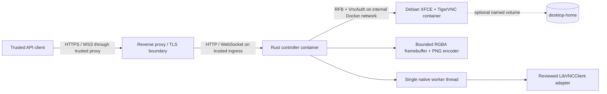

# VNC Remote Control Server

[](https://github.com/ekkus93/vnc-remote-control-server/actions/workflows/ci.yml)
[](https://github.com/ekkus93/vnc-remote-control-server/actions/workflows/release-gates.yml)

VNC Remote Control Server is a containerized Rust service that observes and controls one isolated Debian graphical desktop through the VNC Remote Framebuffer protocol. The repository also ships a typed Python client and an optional MCP adapter that exposes the same reviewed controller operations without implementing a second VNC stack.

## Product boundary

v0.1 provides pixel observation and remote-desktop input primitives for exactly one project-owned Debian desktop. It exposes authenticated HTTP and WebSocket APIs for connection state, display metadata, PNG screenshots, pointer input, keyboard input, clipboard state, reconnect requests, metrics, and revision events.

The optional `vnc-remote-control-mcp` process is a thin adapter over that authenticated controller API. It provides stdio by default and explicit loopback-only Streamable HTTP, is read-only by default, and requires an explicit process-wide opt-in before mutation tools are registered. See [`docs/MCP_SERVER.md`](docs/MCP_SERVER.md).

OCR, Playwright, accessibility-tree automation, AI planning, multiple sessions, arbitrary external VNC servers, and a browser viewer are outside the v0.1 scope.

A project-owned desktop image may be customized or replaced without changing the Rust or Python API layers as long as it preserves the tested VNC contract. This is different from claiming support for arbitrary external VNC servers. See [`docs/CUSTOM_DESKTOP_IMAGES.md`](docs/CUSTOM_DESKTOP_IMAGES.md).

## Architecture



Production Compose keeps raw VNC on an internal-only network. Only the controller joins the API-ingress network. The controller API binds to `127.0.0.1:8080` on the host by default.

The MCP path reuses the same controller boundary:

```text
MCP host/client
        |
        | stdio or loopback Streamable HTTP
        v
vnc-remote-control-mcp
        |
        | typed VncRemoteControlClient + controller bearer token from file
        v
Rust controller -> worker -> LibVNCClient -> project-owned VNC desktop
```

The MCP adapter never connects directly to raw VNC and never adds an automatic mutation retry/replay layer.

The configuration chain is intentionally split into two independent hops:

```text
Python VncClient(base_url, api_token)
        |
        | HTTP / WebSocket
        v
Rust controller
        |
        | VRC_VNC_HOST / VRC_VNC_PORT / VRC_VNC_PASSWORD_FILE
        v
project-owned VNC desktop container
```

Changing the desktop image does not require changing Python code when the Rust controller remains at the same API address.

## Current status

The implementation on `master` includes:

- a warning-denied Rust workspace with a reviewed LibVNCClient adapter;
- a single-owner native worker with bounded queues, reconnect, stall detection, and graceful shutdown;
- fail-closed input-session quarantine: any ambiguous native pointer/key send failure preserves the command failure, drops the tainted VNC session, and reconnects before later input can execute;
- coherent framebuffer snapshots, PNG encoding, ETags, conditional requests, and revision events;
- complete v0.1 pointer, keyboard, text, and clipboard control;
- authenticated HTTP and WebSocket APIs with bounded overload behavior and payload-free observability;
- an explicit accepted-HTTP-connection bound (`VRC_HTTP_MAX_CONNECTIONS`, default 256, valid range 1–65536) whose permit lifetime follows the full connection task;
- hosted Swagger UI, ReDoc, and raw OpenAPI 3.1 documentation;
- a typed Python client with zero third-party dependencies for HTTP and optional WebSocket event support;
- an optional MCP server extra pinned to `mcp==2.1.1`, with stdio and SDK-protected loopback Streamable HTTP, read-only-by-default tool registration, bounded controller-call execution, native screenshot image output, and fail-closed mutation outcome classification;
- an installed `vnc-remote-control-demo` CLI for exercising status, screenshots, pointer/keyboard input, clipboard, reconnect, metrics, and bounded WebSocket event streaming;
- non-root desktop and controller images;
- production Compose with file-mounted secrets, internal-only raw VNC, a read-only controller filesystem, bounded temporary storage, and optional desktop-home persistence;
- real TigerVNC, HTTP/WebSocket, Compose, reconnect, resource-bound, shutdown, Python/MCP-contract, and documentation-contract validation.

The current operational/reference documentation is indexed in [`docs/README.md`](docs/README.md). Dated specs, TODOs, implementation notes, review documents, and evidence files are retained as point-in-time engineering records; they are not the authority for current `master` when later implementation work has superseded them.

Release acceptance is fail-closed: both permanent `CI` and `Release Gates` must pass on the exact candidate SHA. The current policy is documented in [`docs/VNC_REMOTE_CONTROL_SERVER_RELEASE_POLICY_2026-08-05.md`](docs/VNC_REMOTE_CONTROL_SERVER_RELEASE_POLICY_2026-08-05.md), and [`docs/CI_STATUS_BRIDGE.md`](docs/CI_STATUS_BRIDGE.md) explains the persistent issue used to discover the latest authoritative `CI` result for `master`.

## Security revalidation reminder

**Before September 30, 2026**, rebuild both container images from current Debian base images, refresh the pinned base-image digests as appropriate, run the repository's Trivy-backed Release Gates, and re-review every remaining CRITICAL finding recorded in [`security/trivy-critical-vex.json`](security/trivy-critical-vex.json).

Running `apt update` and `apt upgrade` inside an existing container is not sufficient. Produce new images from updated base images and package indexes, rescan those exact images, remove resolved VEX entries, and renew only the remaining determinations that are still demonstrably non-exploitable. An expired or mismatched determination must continue to fail closed. [Issue #7](https://github.com/ekkus93/vnc-remote-control-server/issues/7) tracks this maintenance work.

## Quick start

### Prerequisites

- Linux with Docker Engine and Docker Compose v2;
- `curl` for API examples;
- `openssl` for local secret generation;
- free loopback port `8080`, or set `VRC_API_HOST_PORT` to another port.

Create local secrets:

```bash
install -d -m 0700 deploy/secrets
umask 077
openssl rand -hex 32 > deploy/secrets/api_token.txt
openssl rand -hex 4 > deploy/secrets/vnc_password.txt
chmod 0444 deploy/secrets/api_token.txt deploy/secrets/vnc_password.txt
```

Start the disposable production topology:

```bash
docker compose -f deploy/compose.yaml up --build --detach --wait
```

Check health and authenticated status:

```bash
BASE_URL=http://127.0.0.1:8080
API_TOKEN="$(cat deploy/secrets/api_token.txt)"

curl --fail-with-body "$BASE_URL/health/live"
curl --fail-with-body \
  --header "Authorization: Bearer $API_TOKEN" \
  "$BASE_URL/v1/status"
```

Open the hosted API reference in a browser:

- Swagger UI: `http://127.0.0.1:8080/docs`
- ReDoc: `http://127.0.0.1:8080/redoc`
- Raw OpenAPI 3.1 JSON: `http://127.0.0.1:8080/openapi.json`

The documentation routes are public, but every `/v1/*` operation invoked from Swagger UI still requires the normal bearer token. Swagger UI does not persist authorization across reloads and has its external validator disabled. The UI JavaScript/CSS (exact-version `swagger-ui-dist` 5.32.11 and ReDoc 2.5.3) is vendored into the repository and served locally by the controller — no CDN or other third-party runtime script/style dependency exists for `/docs` or `/redoc`. The API specification itself is also served locally from the repository-owned `docs/openapi.json` contract. See [`crates/controller-api/third_party/MANIFEST.md`](crates/controller-api/third_party/MANIFEST.md) for exact upstream sources, licenses, and pinned digests.

### Python client, demo, and MCP adapter

Install the in-repository Python client from a local checkout:

```bash
python -m pip install ./python
```

Or install it directly from GitHub:

```bash
python -m pip install \
  "vnc-remote-control-client @ git+https://github.com/ekkus93/vnc-remote-control-server.git@master#subdirectory=python"
```

For WebSocket event streaming, install the optional extra locally or from GitHub:

```bash
python -m pip install './python[websocket]'
python -m pip install \
  "vnc-remote-control-client[websocket] @ git+https://github.com/ekkus93/vnc-remote-control-server.git@master#subdirectory=python"
```

For MCP, install the exact-reviewed optional extra:

```bash
python -m pip install './python[mcp]'
```

The default MCP transport is stdio. With the controller running, supply only the controller-token **file path** and launch the executable:

```bash
VRC_MCP_CONTROLLER_TOKEN_FILE="$PWD/deploy/secrets/api_token.txt" \
vnc-remote-control-mcp
```

Mutation tools are absent unless `VRC_MCP_ALLOW_MUTATIONS=true`. Explicit Streamable HTTP remains loopback-only and defaults to `http://127.0.0.1:8765/mcp`; remote access must use a trusted tunnel/authenticated proxy boundary rather than a public MCP bind. See [`docs/MCP_SERVER.md`](docs/MCP_SERVER.md) for the complete configuration and security contract.

For deployments and reproducible automation, pin the GitHub install to a full commit SHA instead of `master`. See [`python/README.md`](python/README.md) for a known-good pinned example and upgrade guidance.

Library example:

```python
from pathlib import Path

from vnc_remote_control import VncClient

api_token = Path("deploy/secrets/api_token.txt").read_text(encoding="utf-8").strip()
client = VncClient("http://127.0.0.1:8080", api_token)

print(client.get_status())
client.move_pointer(640, 400)
client.click_pointer(640, 400)
client.type_keyboard_text("hello from Python")
```

Installing the package also installs the demo CLI:

```bash
vnc-remote-control-demo \
  --base-url http://127.0.0.1:8080 \
  --token-file deploy/secrets/api_token.txt \
  overview
```

The demo intentionally accepts a token file rather than a raw bearer-token command-line argument. See [`python/README.md`](python/README.md) for screenshot, pointer, keyboard, clipboard, reconnect, metrics, and WebSocket event examples.

The HTTP client has no third-party runtime dependencies. It exposes typed responses and structured API errors, supports conditional screenshot ETags, and does not silently clamp invalid input.

### Custom desktop images

The preferred customization workflow is to derive a desktop image from the repository's known-good TigerVNC/XFCE image, add applications, and keep the Compose service named `desktop`. The controller can then continue using:

```text
VRC_VNC_HOST=desktop
VRC_VNC_PORT=5901
```

while the Python client continues pointing at the same Rust API URL. See [`docs/CUSTOM_DESKTOP_IMAGES.md`](docs/CUSTOM_DESKTOP_IMAGES.md) for the complete VNC-container contract, Dockerfile example, Compose override example, secret/network requirements, supported-vs-unsupported boundary, and validation checklist.

Stop the stack and remove disposable state:

```bash
docker compose -f deploy/compose.yaml down --volumes --remove-orphans
```

## Documentation

Start with [`docs/README.md`](docs/README.md), which distinguishes living/current documentation from historical milestone artifacts.

- Hosted Swagger UI: `/docs`.
- Hosted ReDoc: `/redoc`.
- Hosted raw OpenAPI: `/openapi.json`.
- [`docs/MCP_SERVER.md`](docs/MCP_SERVER.md): MCP architecture, optional install, stdio and loopback Streamable HTTP, full configuration, read-only/mutation policy, secret handling, and unknown-outcome recovery.
- [`python/README.md`](python/README.md): Python client installation from a local checkout or directly from GitHub, reproducible commit pinning, endpoint usage, demo CLI, MCP entry point, screenshots, WebSocket events, and errors.
- [`docs/CUSTOM_DESKTOP_IMAGES.md`](docs/CUSTOM_DESKTOP_IMAGES.md): custom project-owned VNC desktop images, controller target configuration, Docker networking, and the Python → controller → desktop configuration chain.
- [`docs/OPERATOR_GUIDE.md`](docs/OPERATOR_GUIDE.md): deployment, lifecycle, recovery, tuning, examples, hosted API docs, Python/MCP discovery, and troubleshooting.
- [`docs/openapi.json`](docs/openapi.json): OpenAPI 3.1 contract for the supported controller API.
- [`docs/WEBSOCKET_EVENTS.md`](docs/WEBSOCKET_EVENTS.md): event envelope, event types, heartbeat behavior, and close codes.
- [`deploy/README.md`](deploy/README.md): Compose topology and mode-specific commands.
- [`docs/CI_STATUS_BRIDGE.md`](docs/CI_STATUS_BRIDGE.md): current CI status publication/discovery contract.
- [`CONTRIBUTING.md`](CONTRIBUTING.md): development prerequisites and quality commands.
- [`SECURITY.md`](SECURITY.md): security boundaries, secret lifecycle, MCP Python-memory limitation, and residual-risk policy.

## Security boundaries

- Never publish raw VNC port `5901` from production Compose.
- Use the debug VNC override only on a local development machine; it binds to loopback.
- Keep API and VNC credentials in files. Do not put secret values in environment variables, images, source control, command history, or URLs.
- The MCP controller token is also file-only: `VRC_MCP_CONTROLLER_TOKEN_FILE` contains a path, never the raw token.
- Do not log typed text, clipboard contents, VNC passwords, bearer tokens, or screenshots.
- Keep the API on loopback or behind a trusted TLS reverse proxy. The controller does not terminate TLS itself.
- Keep MCP Streamable HTTP on the adapter's enforced loopback hosts. It has no project-specific client authentication; use stdio or a trusted authenticated tunnel/proxy for remote access and never disable the SDK Host/Origin/DNS-rebinding checks.

Request IDs are process-local correlation values. The generated request-ID sequence is checked and never wraps or reuses a normal sequence value. If that sequence reaches its terminal limit, routed HTTP requests fail closed before authentication or handler execution with HTTP `503`, error code `request_id_exhausted`, and the reserved `X-Request-ID: request-id-exhausted` sentinel. A caller-provided request ID cannot bypass the terminal state. The exhaustion diagnostic is payload-free.

## Development

The supported Rust toolchain is pinned in [`rust-toolchain.toml`](rust-toolchain.toml). Common commands:

```bash
make fmt
make lint
make test
make build
make integration-test
```

Run all first-party Python/MCP, documentation, and workflow contracts with the exact MCP test extra installed:

```bash
python -m pip install -e './python[mcp]'
python3 -m unittest discover -s tests -p 'test_*.py' -v
```

Warnings and failing gates are defects. Fix their causes; do not suppress, downgrade, or silently bypass them.

## License

MIT License. See [`LICENSE`](LICENSE).
