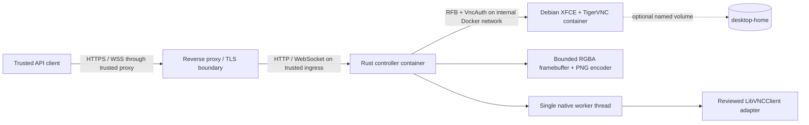

# VNC Remote Control Server

[](https://github.com/ekkus93/vnc-remote-control-server/actions/workflows/ci.yml)

VNC Remote Control Server is a containerized Rust service that observes and controls one isolated Debian graphical desktop through the VNC Remote Framebuffer protocol.

## Product boundary

v0.1 provides pixel observation and remote-desktop input primitives for exactly one project-owned Debian desktop. It exposes authenticated HTTP and WebSocket APIs for connection state, display metadata, PNG screenshots, pointer input, keyboard input, clipboard state, reconnect requests, metrics, and revision events.

OCR, Playwright, accessibility-tree automation, AI planning, multiple sessions, arbitrary external VNC servers, and a browser viewer are outside the v0.1 scope.

## Architecture



Production Compose keeps raw VNC on an internal-only network. Only the controller joins the API-ingress network. The controller API binds to `127.0.0.1:8080` on the host by default.

## Current status

The implementation on `master` includes:

- a warning-denied Rust workspace with a reviewed LibVNCClient adapter;
- a single-owner native worker with bounded queues, reconnect, stall detection, and graceful shutdown;
- coherent framebuffer snapshots, PNG encoding, ETags, conditional requests, and revision events;
- complete v0.1 pointer, keyboard, text, and clipboard control;
- authenticated HTTP and WebSocket APIs with bounded overload behavior and payload-free observability;
- non-root desktop and controller images;
- production Compose with file-mounted secrets, internal-only raw VNC, a read-only controller filesystem, bounded temporary storage, and optional desktop-home persistence;
- real TigerVNC, HTTP/WebSocket, Compose, reconnect, resource-bound, and shutdown E2E validation.

The authoritative plan remains:

- [`docs/VNC_REMOTE_CONTROL_SERVER_REBASE_SPEC_2026-08-03.md`](docs/VNC_REMOTE_CONTROL_SERVER_REBASE_SPEC_2026-08-03.md)
- [`docs/VNC_REMOTE_CONTROL_SERVER_REBASE_TODO_2026-08-03.md`](docs/VNC_REMOTE_CONTROL_SERVER_REBASE_TODO_2026-08-03.md)

The service is not yet declared a final v0.1 release. Security hardening and the final same-SHA acceptance gate remain separate milestones.

## Quick start

### Prerequisites

- Linux with Docker Engine and Docker Compose v2;
- `curl` for API examples;
- `openssl` for local secret generation;
- free loopback port `8080`, or set `VRC_API_HOST_PORT` to another port.

Create local secrets:

```bash
install -d -m 0700 deploy/secrets
umask 077
openssl rand -hex 32 > deploy/secrets/api_token.txt
openssl rand -hex 4 > deploy/secrets/vnc_password.txt
chmod 0444 deploy/secrets/api_token.txt deploy/secrets/vnc_password.txt
```

Start the disposable production topology:

```bash
docker compose -f deploy/compose.yaml up --build --detach --wait
```

Check health and authenticated status:

```bash
BASE_URL=http://127.0.0.1:8080
API_TOKEN="$(cat deploy/secrets/api_token.txt)"

curl --fail-with-body "$BASE_URL/health/live"
curl --fail-with-body \
  --header "Authorization: Bearer $API_TOKEN" \
  "$BASE_URL/v1/status"
```

Stop the stack and remove disposable state:

```bash
docker compose -f deploy/compose.yaml down --volumes --remove-orphans
```

## Documentation

- [`docs/OPERATOR_GUIDE.md`](docs/OPERATOR_GUIDE.md): deployment, lifecycle, recovery, tuning, examples, and troubleshooting.
- [`docs/openapi.json`](docs/openapi.json): OpenAPI 3.1 contract for every HTTP route.
- [`docs/WEBSOCKET_EVENTS.md`](docs/WEBSOCKET_EVENTS.md): event envelope, event types, heartbeat behavior, and close codes.
- [`deploy/README.md`](deploy/README.md): Compose topology and mode-specific commands.
- [`CONTRIBUTING.md`](CONTRIBUTING.md): development prerequisites and quality commands.
- [`SECURITY.md`](SECURITY.md): vulnerability-reporting policy.

## Security boundaries

- Never publish raw VNC port `5901` from production Compose.
- Use the debug VNC override only on a local development machine; it binds to loopback.
- Keep API and VNC credentials in files. Do not put secret values in environment variables, images, source control, command history, or URLs.
- Do not log typed text, clipboard contents, VNC passwords, bearer tokens, or screenshots.
- Keep the API on loopback or behind a trusted TLS reverse proxy. The controller does not terminate TLS itself.

## Development

The supported Rust toolchain is pinned in [`rust-toolchain.toml`](rust-toolchain.toml). Common commands:

```bash
make fmt
make lint
make test
make build
make integration-test
```

Warnings and failing gates are defects. Fix their causes; do not suppress, downgrade, or silently bypass them.

## License

MIT License. See [`LICENSE`](LICENSE).
