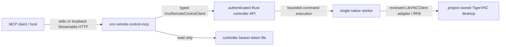

# MCP Server

This is the living operator and security guide for the Model Context Protocol (MCP) adapter shipped by VNC Remote Control Server. It describes the behavior of current `master`; dated MCP specifications, TODOs, and evidence files are historical engineering records.

The MCP adapter is a thin Python layer over the existing typed controller client. It does **not** implement VNC/RFB itself and it does not bypass the Rust controller's authentication, validation, command-outcome, queue, or worker semantics.

## Architecture and trust boundary



The two authentication boundaries are intentionally different:

- the MCP adapter authenticates **to the Rust controller** with the controller bearer token read from `VRC_MCP_CONTROLLER_TOKEN_FILE`;
- the initial MCP transport does **not** authenticate MCP clients itself.

For stdio, access is inherited from the parent process and its child-process pipes. For Streamable HTTP, the listener is restricted to SDK-protected loopback addresses. Loopback is a network-exposure boundary, not per-user authorization: another process running as a user that can reach the local listener may be able to call its tools. Treat every MCP client with transport access as trusted to observe the desktop, and as trusted to control it whenever mutation tools are enabled.

Prefer stdio when the MCP host can launch the adapter directly. Use Streamable HTTP only when a loopback listener is operationally necessary.

## Install

The Python package is `vnc-remote-control-client`. The core HTTP client has zero third-party runtime dependencies:

```bash
python -m pip install ./python
```

MCP support is an optional extra and uses the exact-reviewed official Python SDK pin `mcp==2.1.1`:

```bash
python -m pip install './python[mcp]'
```

Installing the extra installs the `vnc-remote-control-mcp` console entry point. If MCP support is requested without the extra installed, startup fails explicitly with the required package and install hint; the adapter does not silently downgrade to another protocol or implementation.

For a reproducible deployment from GitHub, pin the repository URL to a reviewed full commit SHA rather than following `master`; see [`../python/README.md`](../python/README.md).

## Required controller setup

The Rust controller must already be running and reachable from the MCP process. With the repository's default Compose topology it is available on `http://127.0.0.1:8080`.

The MCP process requires the controller bearer-token **file path**. Do not put the bearer token itself in an environment variable, command-line argument, URL, source file, or MCP configuration field.

For the default local checkout:

```bash
export VRC_MCP_CONTROLLER_TOKEN_FILE="$PWD/deploy/secrets/api_token.txt"
```

The variable contains only a path. The adapter reads the file and sends the resulting bearer token only to the configured controller API.

## Run with stdio (default)

With `VRC_MCP_CONTROLLER_TOKEN_FILE` set:

```bash
vnc-remote-control-mcp
```

`VRC_MCP_TRANSPORT` defaults to `stdio`, so no listener is created. The pinned SDK owns protocol framing: MCP protocol data uses stdout and diagnostics use stderr.

The reviewed stdio shutdown contract is host-owned. An MCP host should close the child's stdin to deliver EOF, wait boundedly, and then apply its normal process escalation policy if the child does not exit. The adapter deliberately does not install a signal-only compatibility shim around `mcp==2.1.1`; the pinned SDK can have a worker blocked on its private stdin duplicate, so pretending that signal-only unwinding is reliable can hang shutdown.

## Run with loopback Streamable HTTP

Select Streamable HTTP explicitly:

```bash
VRC_MCP_CONTROLLER_TOKEN_FILE="$PWD/deploy/secrets/api_token.txt" \
VRC_MCP_TRANSPORT=streamable-http \
vnc-remote-control-mcp
```

The default endpoint is:

```text
http://127.0.0.1:8765/mcp
```

The adapter accepts only the exact loopback host spellings for which `mcp==2.1.1` automatically enables its DNS-rebinding protection: `127.0.0.1`, `localhost`, and `::1`. `::1` requires working IPv6 loopback support in the host/runtime. A non-loopback value fails configuration before the MCP server is constructed; `0.0.0.0`, public addresses, arbitrary interface names, and other `127/8` aliases are not accepted.

The adapter deliberately leaves the official SDK's transport-security configuration authoritative. Do not disable or replace the SDK Host, Origin, or DNS-rebinding checks as a deployment workaround. The HTTP transport runs with `stateless_http=True`, so persistent MCP sessions do not accumulate; controller-call concurrency is independently bounded by `VRC_MCP_MAX_CONCURRENT_CALLS`.

Legacy SSE is not exposed as a compatibility fallback.

### HTTP process shutdown

The pinned HTTP path runs through Uvicorn. On POSIX, Uvicorn performs its graceful shutdown and then re-raises a captured termination signal after restoring the original signal handler. A parent process can therefore observe a signal return status such as `-SIGTERM` even though Uvicorn completed its normal `Shutting down` / `Finished server process` lifecycle first. Do not equate that process status alone with an unclean shutdown.

## Remote access: tunnel or authenticated proxy, never a public bind

The initial MCP HTTP server has no bespoke remote-client authentication protocol and cannot be configured to bind publicly. Do not patch or wrap the adapter to accept `0.0.0.0` merely to reach it remotely.

A trusted SSH local-forward is the simplest supported remote boundary. Start the adapter on the remote host's loopback address, then from the trusted client machine establish an authenticated tunnel such as:

```bash
ssh -N -L 8765:127.0.0.1:8765 operator@example-host
```

The MCP client then connects locally to:

```text
http://127.0.0.1:8765/mcp
```

The SSH authentication and host trust establish the remote access boundary while the MCP listener itself remains on remote loopback.

A trusted reverse proxy/tunnel product may also connect to the loopback backend if it supplies its own reviewed client authentication and TLS/network boundary. The backend request must still satisfy the official SDK Host/Origin checks. Do not disable those checks or substitute a permissive `transport_security` configuration to accommodate a proxy. If a proxy cannot preserve the protected backend contract, use a tunnel instead.

Browser-origin cross-site exposure is not an initial supported deployment model.

## Read-only default and mutation opt-in

The default is:

```text
VRC_MCP_ALLOW_MUTATIONS=false
```

In that mode the mutation tools are **not registered**. The always-present read-only catalog is:

- `vnc_get_status`
- `vnc_get_display`
- `vnc_get_screenshot` — returns native MCP image content, not JSON/base64 text
- `vnc_get_clipboard`
- `vnc_get_command_status`
- `vnc_get_metrics`

To expose the reviewed mutation catalog, opt in explicitly:

```bash
VRC_MCP_ALLOW_MUTATIONS=true \
VRC_MCP_CONTROLLER_TOKEN_FILE="$PWD/deploy/secrets/api_token.txt" \
vnc-remote-control-mcp
```

Mutation tools are:

- `vnc_move_pointer`
- `vnc_set_pointer_button`
- `vnc_click_pointer`
- `vnc_double_click_pointer`
- `vnc_scroll_pointer`
- `vnc_set_keyboard_key`
- `vnc_send_keyboard_chord`
- `vnc_type_keyboard_text`
- `vnc_set_clipboard`
- `vnc_request_reconnect`

Enabling mutations is process-wide. There is no per-MCP-user authorization layer. Every client that can access that MCP process/HTTP listener must therefore be trusted for the complete exposed mutation surface.

The adapter performs schema/preflight validation but does not clamp, rewrite, retry, or replay a mutation. Each admitted tool call maps to exactly one typed controller-client operation.

## Configuration reference

All MCP process configuration is environment-based. Secret **values** are the exception: the environment carries only the controller-token file path.

| Variable | Default | Accepted value / bound | Meaning |
|---|---|---|---|
| `VRC_MCP_CONTROLLER_URL` | `http://127.0.0.1:8080` | Valid controller base URL; credentials, query, and fragment are rejected | Rust controller API used by the typed Python client |
| `VRC_MCP_CONTROLLER_TOKEN_FILE` | required | Nonempty path to a validated secret file | File containing the controller bearer token; no raw-token environment fallback exists |
| `VRC_MCP_CONTROLLER_TIMEOUT_SECONDS` | `5.0` | finite `0.1` through `60.0` seconds | Per-controller HTTP timeout used by the typed client |
| `VRC_MCP_ALLOW_MUTATIONS` | `false` | exactly `0`, `1`, `false`, or `true` | Controls whether mutation tools are registered; parsing is case-sensitive and fail-closed |
| `VRC_MCP_MAX_CONCURRENT_CALLS` | `8` | integer `1` through `64` | Shared bounded controller-call worker/admission capacity |
| `VRC_MCP_TRANSPORT` | `stdio` | exactly `stdio` or `streamable-http` | MCP transport; there is no legacy SSE fallback |
| `VRC_MCP_HTTP_HOST` | `127.0.0.1` | exactly `127.0.0.1`, `localhost`, or `::1` | Streamable HTTP bind host; all accepted values are SDK-protected loopback spellings |
| `VRC_MCP_HTTP_PORT` | `8765` | integer `1` through `65535` | Streamable HTTP bind port |

Unset optional variables use the defaults above. An explicitly present malformed or empty value is not silently replaced with a default.

### Controller-token file validation

`VRC_MCP_CONTROLLER_TOKEN_FILE` is required for both transports. The reader fails closed unless the file satisfies all of the following:

- metadata is readable and the opened object is a regular file;
- size is from 1 byte through 4 KiB (4096 bytes);
- on POSIX, group/other write bits and all execute bits are rejected;
- contents are strict UTF-8;
- trailing carriage-return/line-feed bytes are trimmed, but other whitespace is not silently stripped;
- the value remains nonempty and contains no NUL;
- the typed controller client's bearer-token validation also succeeds.

Errors identify the path/reason without echoing secret bytes. Configuration representation reports only token presence/path metadata, never the bearer-token value.

A private parent directory is still recommended even when a source file is group/world-readable for Compose compatibility. The repository quick start uses `deploy/secrets` mode `0700` around read-only source files.

## Bounded execution and overload

Controller calls are synchronous in the core Python client, so the adapter executes them off the MCP event loop through one adapter-owned thread pool. `VRC_MCP_MAX_CONCURRENT_CALLS` is both the worker count and the admission-slot count.

Admission is fail-fast. A slot is reserved before submission, so calls do not pile up in `ThreadPoolExecutor`'s otherwise unbounded queue. When capacity is exhausted, the tool fails explicitly instead of silently queuing an unbounded backlog. Cancelling an MCP caller does not make a still-running synchronous controller call disappear or prematurely free its capacity slot.

There is no adapter retry loop.

## Mutation outcome and retry safety

A successful mutation returns the controller's real process-local `command_id` and terminal `status="succeeded"`.

A transport/protocol failure after a mutation may be ambiguous: the controller may already have received or executed the operation. The adapter therefore fails closed instead of treating the failure as permission to replay.

### Known command ID

When the controller reports an unknown outcome with a trustworthy command ID, the MCP tool error contains:

- `kind="command_outcome_unknown"`
- the real positive `command_id`
- `outcome="unknown"`
- `retry_safe=false`
- sanitized `request_id` when available
- an instruction to inspect `vnc_get_command_status(command_id)` before deciding on any further mutation.

Do **not** automatically retry or replay the original mutation.

### No trustworthy command ID

If a mutation reaches an ambiguous transport/protocol/unexpected boundary and no trustworthy command ID is available, the error is conservative:

- `kind="mutation_outcome_unknown"`
- `command_id=null`
- `outcome="unknown"`
- `retry_safe=false`

The adapter never fabricates a command ID and never assumes that the request was not received.

### Authoritative known failure

If the controller returns a valid accepted-command failure, the adapter preserves the real `command_id`, `outcome="failed"`, and `retry_safe=false`. It does not retry that mutation.

Preflight validation or adapter-capacity failure that is proven to occur before controller request issuance is classified separately and does not pretend the mutation might have been sent.

Read-only transport/protocol failures remain read errors (`transport_error` or `controller_protocol_error`) rather than being mislabeled as mutation ambiguity.

## Sensitive data and logging

The adapter must not log or place in diagnostic error text:

- typed keyboard text;
- clipboard contents;
- screenshot pixels, PNG bytes, or base64;
- controller bearer-token bytes;
- VNC credentials;
- raw sensitive controller response bodies.

Error classification uses bounded sanitized identifiers/metadata rather than raw payloads. Operators must apply the same rule to MCP hosts, reverse proxies, shell tracing, process supervisors, crash reporting, and any external log collectors.

MCP tool **results** can themselves contain sensitive desktop data. In particular, screenshots and clipboard reads are intentional data-return surfaces. A client authorized to use the MCP transport must be trusted to receive and protect those results.

## Python token-memory limitation

The Rust controller uses project-owned secret types with explicit live-buffer scrubbing guarantees. The Python MCP adapter cannot make the same claim.

After the token file is decoded, the controller token exists in ordinary Python objects including a Python `str`, and Python does not provide a reliable supported way to zeroize all copies of immutable string/bytes data in place. The adapter therefore **does not guarantee zeroization** of controller-token bytes in Python process memory. This limitation also applies to temporary/intermediate copies made by the Python runtime or HTTP stack.

Protect the MCP process as a secret-bearing process: restrict OS access, consider disabling core dumps, protect swap/process inspection as appropriate, and terminate the process when it no longer needs the token. This limitation does not justify moving the token into an environment variable or command line; the secret-file-only ingress policy still reduces accidental disclosure through process listings, shell history, inherited environments, and configuration dumps.

## Failure policy

Configuration, optional dependency, controller protocol, overload, and transport failures are explicit. The adapter does not:

- return an empty success on failure;
- install compatibility fallbacks for missing SDK APIs;
- downgrade Streamable HTTP to legacy SSE;
- disable SDK Host/Origin/DNS-rebinding checks;
- silently enable mutations;
- retry/replay a mutation with uncertain outcome;
- substitute a placeholder screenshot or stale success value.

Warnings and failing validation are defects. Fix their causes rather than weakening the relevant gate.

## Validation

The permanent CI installs the exact MCP extra and runs the MCP unit, contract, stdio, and loopback Streamable HTTP tests as part of the first-party Python suite:

```bash
python -m pip install -e './python[mcp]'
python3 -m unittest discover -s tests -p 'test_*.py' -v
```

The focused living-document contract is:

```bash
python3 -m unittest tests.test_mcp_documentation_contract -v
```

Release acceptance still requires both permanent `CI` and `Release Gates` to pass on the same exact candidate SHA.

See also [`OPERATOR_GUIDE.md`](OPERATOR_GUIDE.md), [`../python/README.md`](../python/README.md), [`../deploy/README.md`](../deploy/README.md), and [`../SECURITY.md`](../SECURITY.md).
